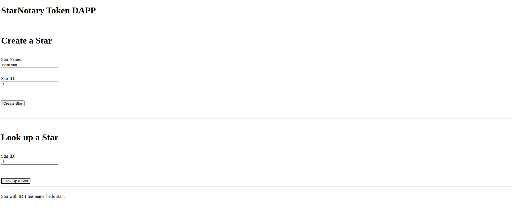

# Smart Contract with Star NFTs

This repository is my solution to the second project of the Udacity "Blockchain Developer" Nanodegree. Below, you find some more information as well as some helpful screenshots.

## What problem does this application solve?
This application is a simple frontend to interact with a smart contract that stores and manages non-fungible star tokens. In the web app, you can create and look up stars, and the contract has some more functionality like buying or exchanging stars.
The contract is deployed on the Rinkeby network with address [0x1c617a8b8d88970ede710395ace9d8421f75e434](https://rinkeby.etherscan.io/address/0x1c617a8b8d88970ede710395ace9d8421f75e434). Name of the token: `CoolStars`, token symbol: `CST`. (Refer to `contracts/StarNotary.sol`)

## Dependencies

- node: 16.14.2 
- npm: 8.5.0 (Use `npm -v`)
- Truffle v5.5.7 (core: 5.5.7)
- Ganache v^7.0.3
- Solidity v0.8.13 (solc-js, set in `truffle-config.js`)
- Node v16.14.2 (Use `node -v`)
- Web3.js v1.5.3
- Metamask: v10.12.3

Within `package.json`:
- "@openzeppelin/contracts": "^4.5.0", (Replaces `openzeppelin-solidity`)
- "@truffle/hdwallet-provider": "^2.0.5", (Replaces truffle-hdwallet-provider)
- "bignumber.js": "^9.0.2",    (For avoiding rounding errors)
- "ethereumjs-tx": "^2.1.2"

## Understanding the code
- `contracts/StarNotary.sol`: the smart contract for our star blockchain. It inherits from `node_modules/@openzeppelin/token/ERC721/ERC721.sol`
- `tests/TestStarNotary.js`: the test cases for StarNotary
- `migrations/2_deploy_contracts`: the settings to deploy StarNotary
- `truffle-config.js`: the truffle configuration, including development and rinkeby network configuration. Attention: for the project to work on rinkeby, you need to store your own rinkeby account mnemonic in a file named `.secret`, since I included mine in `.gitignore` for data protection reasons.
- `app/src/index.js` and `app/src/index.html`: the code for the frontend.


## Run the application

1. Clean the frontend: 
```bash
cd app
# Remove the node_modules  
# remove packages
rm -rf node_modules # Not necessary in case you cloned this repo, as app/node_modules is in .gitignore
# clean cache
npm cache clean # Not necessary in current version of npm
rm package-lock.json
# initialize npm (you can accept defaults)
npm init
# install all modules listed as dependencies in package.json
npm install
```

2. Start ganache: `ganache-cli` (Check whether port is identical with the one in `truffle-config.js`)

3. Set up and start Truffle by running (in the root directory): 
```bash
npm init
npm install
truffle migrate --reset --network development
truffle test # Should give you 9 passing tests
```

4. Start frontend:
```bash
cd app
npm run dev
```
Then open the shown address (probably http://localhost:8080/) in you browser and log into MetaMask (maybe you have to import an account from the development network) to interact with the smart contract.

## Screenshots showing app functionality

1. The frontend: 
- Creating a star
    
(This is a screenshot after confirming, in order to see the owner correctly displayed in the status field.)

- Confirming in MetaMask
    

- Looking up the star
    


